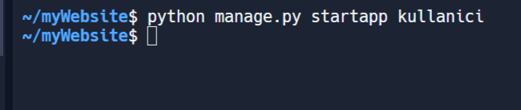

(yarın yapılacak: env ile oluşturup bunları sunular ile uygulamak)
https://drive.google.com/drive/folders/11xwpHA-IrkPJUIdpbB_DMWqlr6XIxjua // sunular

anasayfa app'ın içersinde models.py'var.
buradan database işlemlerini hallediyoruz... (yukarıdaki sunum)

ogrenci kayıt etme: (19. sunu)
https://docs.google.com/presentation/d/14gUagUuAdJv88_Qczbrc0wFAJTAQM_udHo8Bg5xHToc/edit#slide=id.g2959da81c70_0_56

<h2>Replit kullanımı</h2>

replitte komutları shell üzerinden giriyoruz.

